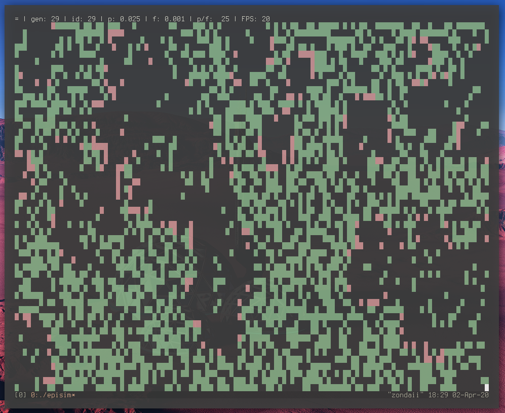

Epidemic Simulator
==================

A work-in-progress exploration of how one could go about simulating an epidemic.
Beginning with a Forest Fire model.



Quick demo: https://www.youtube.com/watch?v=gZ4yIJ1_uvg

TODO
----

### Milestones
- [x] CGOL
- [x] Forest Fire model
- [ ] Agent mobility
- [ ] Quarantine zones
- [ ] Agent attributes
- [ ] Agent destinations (home, )
- [ ] Domain time

### Improvements
- [ ] Distinguish between sizes of world and screen, screen being a shown
      subset of the world.
- [ ] Aggregates
- [ ] CLI parameters
- [ ] Smart(er) mobility (go to destination rather than wonder randomly)
- [ ] Data export
- [ ] Data plotting
- [ ] Reports
- [x] Runtime parameters
- [x] Runtime controls from any state: play/pause toggle, forward, back, stop
- [ ] Runtime control pipe:

    echo 'play' > control
    echo 'stop' > control
    echo 'back' > control
    echo 'forw' > control
    echo 'set f 0.001' > control
    echo 'set p 0.025' > control

### Maybe
- [ ] limit generation storage to a circular buffer
- [ ] scripting language beyond basic parameter setting
- [ ] GUI. Candidates:
  - https://github.com/Immediate-Mode-UI/Nuklear


Questions
---------

#### How to handle the case of modified past?
##### options
- Recompute timeline?
- Fork timeline?
    - How to navigate forked timelines from the UI?
    - Are forked timelines even useful?
- Disallow changing the past?
##### decision
- Recompute the timeline, incrementally

#### Allow cell occupancy n>1?
##### options
- Yes, then cell is a list of agents.
    - cell occupancy limit becomes another sim parameter
    - how to display occupancy n>1 as a single character?
- No, then attempt to co-occupy must be rejected
    - how to handle the rejection when multiple agents attempt to occupy on the
      same time step/gen?
        - transaction abort of some sort?
            - 2 grid passes:
                1. place agents in waiting rooms
                2. check for collisions and reject:
                    a. n - 1 candidates?
                    b. n candidates?

Notes
-----

2 approaches:
1. cellular (state is of a location)
2. agent-based (state is of an agent changing locations)

For the cellular approach - forest fire model can be augmented with an extra
state: immunity.

parameters:
- starting percentage of grid occupancy (tree/empty ratio)
- non-uniformity of grid occupancy distribution
- limited number of spontaneous outbreaks
    - static
    - dynamic, but relative to something else
    - only certain locations

```
    states:

    1. empty
    2. tree
    3. burning

    1. dead
    2. healthy
    3. sick

    1. virgin
    2. sick
    3. immune
    4. dead

    - id infectious dead
    - cd clean dead
    - cv clean virgin
    - ci clean immune
    - is infectious sick
    - ii infectious immune

    c d  clean       dead
    i d  infectious  dead
    c i  clean       immune
    i i  infectious  immune
    c v  clean       virgin
    i s  infectious  sick

    cv +-> is ---+-> id --> cd
       |   |     |
       |   v     v
       +-> ii -> ci
```
